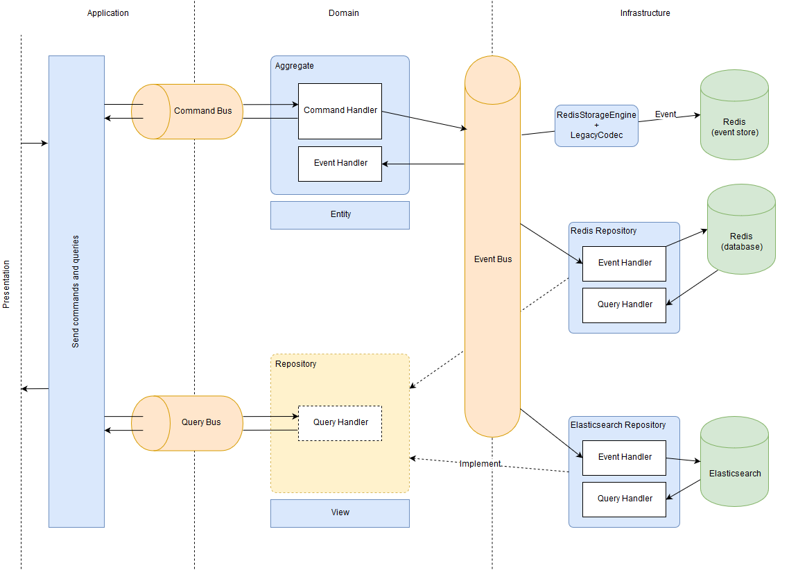

# CQRS et Event Sourcing

Nous avons décidé d'utiliser le framework Axon pour faciliter l'aspect CQRS/Event Sourcing de l'application.

Le principe *CQRS* (Command Query Responsability Segregation) consiste à séparer strictement les accès en écriture (Command) des accès en lecture (Query). Le pattern *Event Sourcing* consiste à stocker les évènements plutôt que l'état de l'application.

Axon n'impose pas d'utiliser l'Event Sourcing mais le permet. L'application existante fonctionne en Event Sourcing. Pour assurer la *rétrocompatibilité* avec l'existant, nous avons dû utiliser ce pattern dans la nouvelle application.

Voici un schéma de l'architecture de la nouvelle application :

## Commands / Events / Aggregates

D'un côté, nous avons les *commandes*. Par exemple, CreateModuleCommand.

La couche Application, qui contient les cas d'utilisation d'un agrégat, émet une commande sur le *Command Bus*, géré par Axon.

Un agrégat, défini dans la couche Domain, intercepte cette commande à l'aide d'un *Command Handler*, puis émet un évènement. Par exemple : ModuleCreatedEvent.

Cet évènement transite sur l'*Event Bus* géré par Axon, est intercepté par un *Event Handler* et stocké dans un *Event Store*.

Notre Event Store est un Redis. Axon ne gère pas nativement le stockage des évènements dans Redis (il le fait pour Mongo, par exemple). Il faut donc indiquer à Axon comment stocker ces évènements dans Redis. C'est le rôle de la classe *RedisStorageEngine*.

De plus, pour des raisons de rétrocompatibilité, nous devons transformer ceux qui sont générés par Axon au format Legacy. C'est le rôle de la classe *LegacyCodec* (et de tout le package `org.hesperides.infrastructure.redis.eventstores.legacy`).

À chaque évènement, l'état d'une entité est persisté sous forme de vue dans un espace physique représenté par Redis et Elasticsearch.

À noter que les évènements et les commandes sont des objets *immuables*. On gère cette aspect à l'aide du framework Lombok et de l'annotation `@Val`.

### Particularité de notre architecture

Afin d'être compatible avec l'application actuelle, il est nécessaire de stocker certains états dans Elasticsearch. Mais on doit aussi stocker les autres états, ceux dont l'application actuelle n'a pas besoin, pour la partie Query.

Nous avons décidé d'utiliser le Redis existant pour cela. L'état final des entités Hespérides est donc stocké dans le Redis, dans un premier temps. *On verra par la suite pour stocker les états et les évènements ailleurs (Mongo par exemple).*

L'historique est un cas particulier et nous avons décidé de stocker les évènements dans Elasticsearch pour fournir les données nécessaires à cet historique.

*À voir si le stockage des états dans Redis est possible pour tous les cas d'utilisation.*

## Queries

De l'autre côté, nous avons les *requêtes* qui servent à récupérer des données qui seront envoyées au client de l'application.

La couche Application émet une requête sur le *Query Bus*. Elle est interceptée par un *Query Handler* déclaré dans la couche Domain et implémenté dans la couche Infrastructure.

Une requête retourne une *vue*, définie dans la couche Domain, qui est la représentation des données sous forme d'objet Java.

La façon dont les données sont effectivement récupérées (d'une base de données par exemple), dépend de l'implémentation dans laquelle se trouve le Query Handler.
