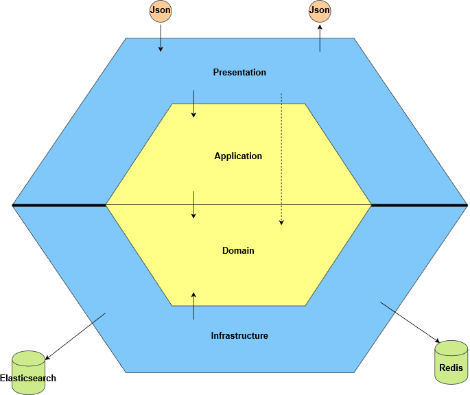

# DDD - Architecture hexagonale

L'application est conçue sur un modèle d'*architecture hexagonale* représentée par 4 couches :
* Presentation
* Application
* Domain
* Infrastructure

## Presentation

La couche Presentation contient l'API (les endpoints), effectue le contrôle des inputs et renvoie les outputs. Inputs et outputs sont au format Json.

Elle dépend de la couche Application, qui elle même dépend de la couche Domain. Elle peut donc directement accéder à la couche Domain si besoin.

## Application

La couche Application contient la logique applicative, c'est-à-dire les cas d'utilisation associés à un agrégat (notion centrale en DDD, nous y revenons dans la couche Domain). Elle déclenche les Query et les Command qui sont interceptées dans la couche Domain.

Par exemple, on vérifie qu'un module n'existe pas déjà, via une Query, avant le créer, via une Command.

## Domain

La couche Domain ne dépend d'aucune autre couche.

Elle contient la logique métier, c'est-à-dire les entités du domaine regroupées en agrégats. Un agrégat est un ensemble d'entités que l'on peut voir comme une unité. Souvent, il porte le nom de son entité racine. Une entité racine est le point d'entrée d'un agrégat. Les autres entités n'ont pas lieu d'être sans cette entité racine.

Un exemple simple : l'adresse postale du client d'une boutique n'a pas d'intérêt seule. Client et Adresse sont deux entités distinctes qui forment un agrégat dont l'entité racine est Client. On peut nommer cet agrégat Client.

Un exemple dans notre Domain : un Template est forcément lié à un Module. Le Template est une entité qui appartient à l'aggrégat "Module".

La couche Domain contient aussi :
* Les interfaces des Repository implémentées dans la couche infrastructure
* La définition des Command et Query qui transitent sur le Command Bus et le Query Bus
* Les erreurs sous forme d'exceptions

## Infrastructure

La couche Infrastructure *implémente* la couche Domain.

Le domaine définit ce que le Repository *doit* faire. L'infrastructure implémente *comment* le faire.

Elle permet d'accéder aux partenaires externes. C'est ici qu'on trouve le "bruit technique" (accès à une base de données, à une ressource externe, etc.). Les interfaces *génériques* définies dans la couche Domain sont implémentées de manière *spécifique* dans la couche Infrastructure.

Par exemple : les classes ElasticsearchModuleRepository et RedisModuleRepository (Infrastructure) implémentent l'interface ModuleRepository (Domain).
