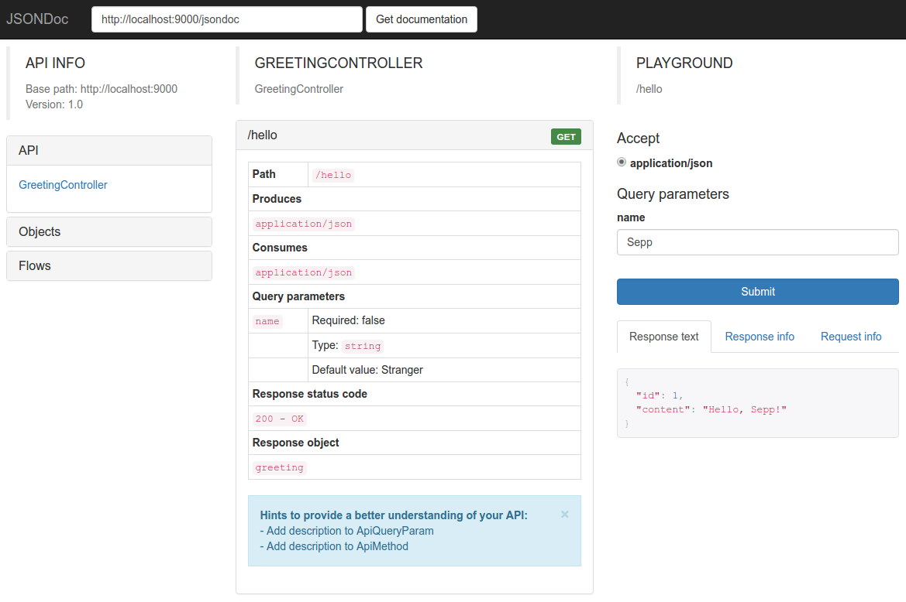
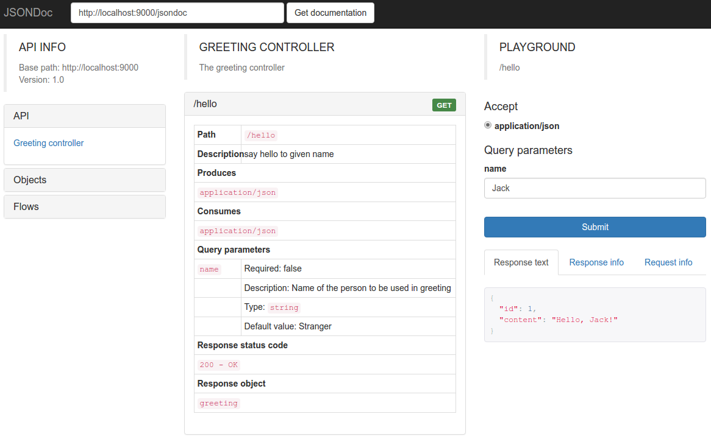

# JSONDoc GUI and API documentation

Homepage: <http://jsondoc.org>

"JSONDoc is useful if you want to write and generate the documentation of your Java RESTful API,
expose it with a clear user interface, test API methods with the provided playground"

## Installation

Our REST-template is a Spring Boot application. Installing JSONDoc is therefore as follows (see <http://jsondoc.org/how-to-spring-boot.html>):

File 'pom.xml':

```xml
<properties>
  <version.spring-boot-starter-jsondoc>1.2.17</version.spring-boot-starter-jsondoc>
</properties>

<dependencies>
  <dependency>
    <groupId>org.jsondoc</groupId>
    <artifactId>spring-boot-starter-jsondoc</artifactId>
    <version>${version.spring-boot-starter-jsondoc}</version>
  </dependency>
  ...
</dependencies>
```

## Configuration

see <http://jsondoc.org/configuration.html>

File 'src/main/resources/application.yml':
```yml
jsondoc:
  version: <version of your API>
  basePath: http://localhost:8080/jsondoc
  packages:
    - org.mdz.dzp.rest.search.server
  playgroundEnabled: true
  displayMethodAs: URI 
```

Mandatory configuration properties

| property | description |
|----------|-------------|
| version | The version of your API |
| basePath | The base path of your API, for example http://localhost:8080 |
| packages | The list of packages that JSONDoc will scan to look for annotated classes to be documented |

Optional configuration properties

| property | description |
|----------|-------------|
| playgroundEnabled | Whether the playground should be enabled in the UI or not. Defaults to true. Allowed values: true, false |
| displayMethodAs | Whether to display methods as URIs or with a short description (summary attribute in the @ApiMethod annotation) or with the java method name. Allowed values are URI, SUMMARY, METHOD. Defaults to URI. For example, if displayMethodAs is set to URI, on the UI there will be something like /books/{id}. If it is set to SUMMARY, on the UI there will be something like Gets a book with the given ID. If it is set to METHOD, on the UI there will be something like findBookById. |

Enable JSONDoc on your configuration class:

File 'src/main/java/de/digitalcollections/template/rest/server/frontend/impl/springboot/Application.java':

```java
...
import org.jsondoc.spring.boot.starter.EnableJSONDoc;

...
@EnableJSONDoc
@SpringBootApplication
...
public class Application {
  ...
}
```

At this point it is possible to start up the application and go to http://localhost:9000/jsondoc to see the documentation (provided that you wrote the documentation on your services and objects), ready to be used with jsondoc-ui or with your custom documentation viewer. Even if you did not add any JSONDoc annotations (documentation) to your API-controller, you will get a JSON-document describing all public available endpoints.

## JSONDoc UI

### Installation

File 'pom.xml':

```xml
<properties>
  <version.jsondoc-ui-webjar>1.2.17</version.jsondoc-ui-webjar>
</properties>

<dependencies>
  <dependency>
    <groupId>org.jsondoc</groupId>
    <artifactId>jsondoc-ui-webjar</artifactId>
    <version>${version.jsondoc-ui-webjar}</version>
  </dependency>
  ...
</dependencies>
```

### Usage

Go to http://localhost:9000/jsondoc-ui.html, insert http://localhost:9000/jsondoc (URL to the JSON-summary) in the box and get the documentation.



You also get hints what to improve (e.g. add API documentation ;-) ).

## Add API documentation

see <http://jsondoc.org/annotations.html>

In the following we just pick some of the most used annotations and show simple examples.

### @Api

This annotation has to be used on your controller class in an MVC pattern. It describes in a few words what the API does.

|   |   |   |
|---|---|---|
| Level	| Class |
| Property | name | The name of the API |
|          | description | A description of what the API does. This can contain html tags, that will be properly rendered in the UI |
|          | group | Semantic grouping this API belongs to. For example it is possible to have a Geography group which will contain the City API and the Country API |
|          | visibility | Specifies the visibility of this api: PUBLIC or PRIVATE
|          | stage | Specifies the development stage for this api (PRE-ALPHA, ALPHA, BETA, RC, GA, DEPRECATED) |

Example:

```java
@Api(description = "The greeting controller", name = "Greeting controller")
...
public class GreetingController {
```

### @ApiMethod

This annotation describes your exposed methods in a generic way: which verb has to be used, which is the path for the call, which type it accepts, which one produces, etc.

|   |   |   |
|---|---|---|
| Level | Method |  |
| Property | path | The relative path for this method (ex. /country/get/{name}). The value of this attribute is used in the UI when the displayMethodAs configuration property is set to URI
|          | summary | A short description of what the method does. The value of this attribute is used in the UI when  the displayMethodAs configuration property is set to SUMMARY
|          | description | A description of what the method does. This can contain html tags, that will be properly rendered in the UI
|          | verb | An array representing the request verb(s) for this method. Defaults to GET
|          | produces | An array of strings representing media types produced by the method, like application/json, application/xml, etc
|          | consumes | An array of strings representing media types consumed by the method, like application/json, application/xml, etc
|          | responsestatuscode | Response status code that this method will return to the caller. Defaults to 200
|          | id | A custom identifier to be used inside JSONDoc. This string has to be unique inside the JSONDoc documentation. It's responsibility of the documentation writer to guarantee this uniqueness
|          | visibility | Specifies the visibility of this api: PUBLIC or PRIVATE
|          | stage | Specifies the development stage for this api (PRE-ALPHA, ALPHA, BETA, RC, GA, DEPRECATED)


Example:

```java
import org.jsondoc.core.annotation.ApiMethod;
...
@ApiMethod(description = "say hello to given name")
  @RequestMapping(method = RequestMethod.GET)
  public Greeting sayHello(@RequestParam(value = "name", required = false, defaultValue = "Stranger") String name) {
```

### @ApiQueryParam

This annotation describes a query parameter to be passed to the method

|   |   |   |
|---|---|---|
| Level | Annotation, Parameter |
| Property | name | The name of the query parameter, as expected by the server
|          | description | A description of what the parameter is needed for. This can contain html tags, that will be properly rendered in the UI
|          | required | Whether this parameter is required or not. Defaults to true
|          | allowedvalues | An array representing the allowed values this parameter can have
format	The format from the parameter (ex. yyyy-MM-dd HH:mm:ss)
|          | defaultvalue | The default value for this parameter, if it is not passed in the query string
|          | clazz | Specify this element if you need to use the ApiParam annotation on the method declaration and not inside the method's signature. This is to be able to document old style servlets' methods like doGet and doPost. This element, even if specified, is not taken into account when the annotation is put inside the method's signature

Example:

```java
import org.jsondoc.core.annotation.ApiQueryParam;
...
@ApiMethod(description = "say hello to given name")
  @RequestMapping(method = RequestMethod.GET)
  public Greeting sayHello(
          @ApiQueryParam(
                  name = "name", description = "Name of the person to be used in greeting",
                  defaultvalue = "Stranger", required = false)
          @RequestParam(value = "name", required = false, defaultValue = "Stranger") String name) {
    return new Greeting(counter.incrementAndGet(), String.format(TEMPLATE, name));
  }
```



