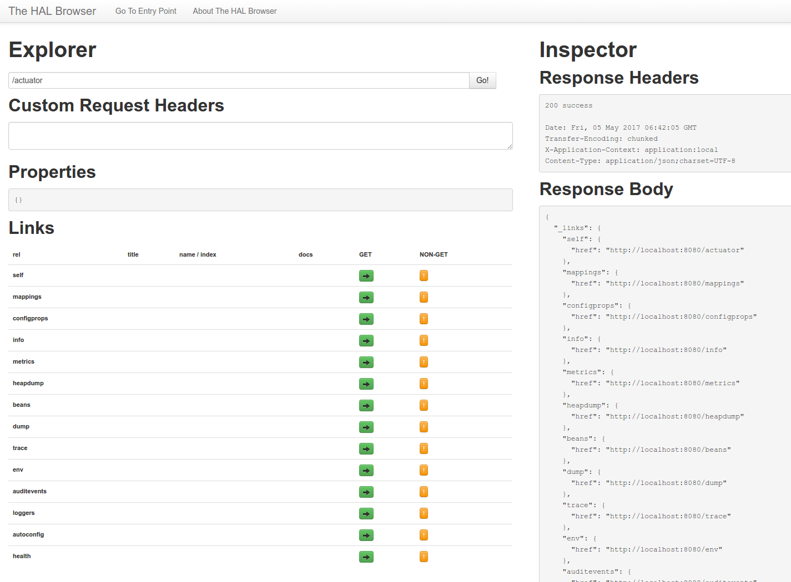

# Spring Actuator

There aren’t any endpoints defined in this application, but there’s enough to launch things and see some of Actuator’s features. 

```sh
$ curl localhost:8080
{"timestamp":1493900533248,"status":404,"error":"Not Found","message":"No message available","path":"/"}
```

Instead of a default container-generated HTML error response, you see a generic JSON response from the Actuator /error endpoint. You can see in the console logs from the server startup which endpoints are provided out of the box.

see <http://docs.spring.io/spring-boot/docs/current/reference/htmlsingle/#production-ready>

Spring Boot includes a number of additional features to help you monitor and manage your application when it’s pushed to production. You can choose to manage and monitor your application using HTTP endpoints, with JMX or even by remote shell (SSH or Telnet). Auditing, health and metrics gathering can be automatically applied to your application.

The way that endpoints are exposed will depend on the type of technology that you choose. Most applications choose HTTP monitoring, where the ID of the endpoint is mapped to a URL. For example, by default, the health endpoint will be mapped to /health.

## Basic endpoints

The following HTTP-endpoints are available:

| Endpoint    |	Description | Sensitive Default |
|-------------|-------------|-------------------|
| /actuator   | Provides a hypermedia-based “discovery page” for the other endpoints. Requires Spring HATEOAS to be on the classpath. | true
| /auditevents| Exposes audit events information for the current application. | true
| /autoconfig | Displays an auto-configuration report showing all auto-configuration candidates and the reason why they ‘were’ or ‘were not’ applied. | true
| /beans      | Displays a complete list of all the Spring beans in your application. | true
| /configprops| Displays a collated list of all @ConfigurationProperties. | true
| /dump       | Performs a thread dump. | true
| /env        | Exposes properties from Spring’s ConfigurableEnvironment. | true
| /flyway     | Shows any Flyway database migrations that have been applied. | true
| /health     | Shows application health information (when the application is secure, a simple ‘status’ when accessed over an unauthenticated connection or full message details when authenticated). | false
| /info       | Displays arbitrary application info. | false
| /liquibase  | Shows any Liquibase database migrations that have been applied. | true
| /loggers    | Shows and modifies the configuration of loggers in the application. | true
| /metrics    | Shows ‘metrics’ information for the current application. | true
| /mappings   | Displays a collated list of all @RequestMapping paths. | true
| /shutdown   | Allows the application to be gracefully shutdown (not enabled by default). | true
| /trace      | Displays trace information (by default the last 100 HTTP requests). | true

Depending on how an endpoint is exposed, the sensitive property may be used as a security hint. For example, sensitive endpoints will require a username/password when they are accessed over HTTP (or simply disabled if web security is not enabled), otherwise you get a "401: Unauthorized" if not authenticated.

If you are using Spring MVC, the following additional endpoints can also be used:

| Endpoint    |	Description | Sensitive Default |
|-------------|-------------|-------------------|
| /docs       | Displays documentation, including example requests and responses, for the Actuator’s endpoints. Requires spring-boot-actuator-docs to be on the classpath. | false
| /heapdump   | Returns a GZip compressed hprof heap dump file. | true
| /jolokia    | Exposes JMX beans over HTTP (when Jolokia is on the classpath). | true
| /logfile    | Returns the contents of the logfile (if logging.file or logging.path properties have been set). Supports the use of the HTTP Range header to retrieve part of the log file’s content. | true

By default all sensitive HTTP endpoints are secured such that only users that have an ACTUATOR role may access them. Security is enforced using the standard HttpServletRequest.isUserInRole method.

### Unsecure actuator endpoints

If you are deploying applications behind a firewall, you may prefer that all your actuator endpoints can be accessed without requiring authentication. You can do this by changing the management.security.enabled property:

Create application configuration file src/main/resources/application.yml:

```yml
management:
  security:
    enabled: false
```

### Secure actuator endpoints

If you’re deploying applications publicly, you may want to add ‘Spring Security’ to handle user authentication. When ‘Spring Security’ is added, by default ‘basic’ authentication will be used with the username `user` and a generated password (which is printed on the console when the application starts).

Adding Spring Security to dependencies:

File `pom.xml`:

```xml
<dependencies>
  ...
  <dependency>
    <groupId>org.springframework.boot</groupId>
    <artifactId>spring-boot-starter-security</artifactId>
  </dependency>
```

You can use Spring application config to change the username and password and to change the security role(s) required to access the endpoints (default role for accessing is "ACTUATOR"). For example, you might set the following in your application.properties:

`src/main/resources/application.yml`:

```yml
management:
  security:
    enabled: true
#    roles: SUPERUSER

security:
  user:
    name: admin
    password: secret
```

Some endpoints deliver different response content depending on with or without authentication (e.g. "/health").

### Testing actuator endpoints

Testing of endpoints can be done with the command line tool `curl` or directly in browser.

- Sample "/health" (no authentication) request and response:

```sh
$ curl -i localhost:8080/health
{
  "status" : "UP"
}
```

- Sample "/health" (with authentication) request and response:

```sh
$ curl-u admin:secret http://localhost:8080/health
{
  "status" : "UP",
  "diskSpace" : {
    "status" : "UP",
    "total" : 120906379264,
    "free" : 13729030144,
    "threshold" : 10485760
  }
}
```

## Endpoint "/actuator"

If `endpoints:hypermedia:enabled:true` is added to`application.yml` and Spring HATEOAS is on the classpath (e.g. through the spring-boot-starter-hateoas or if you are using Spring Data REST) then the HTTP endpoints from the Actuator are enhanced with hypermedia links, and a “discovery page” is added with links to all the endpoints. The “discovery page” is available on `/actuator` by default. It is implemented as an endpoint, allowing properties to be used to configure its path (endpoints.actuator.path) and whether or not it is enabled (endpoints.actuator.enabled).

### pom.xml

```xml
...
<dependency>
  <groupId>org.springframework.boot</groupId>
  <artifactId>spring-boot-starter-hateoas</artifactId>
</dependency>
...
```

### src/main/resources/application.yml

```yml
endpoints:
  hypermedia:
    enabled: true
```

### Default response

When requesting http://localhost:8080/actuator:

```json
{
  "_links": {
    "self": {
      "href": "http://localhost:8080/actuator"
    },
    "mappings": {
      "href": "http://localhost:8080/mappings"
    },
    "heapdump": {
      "href": "http://localhost:8080/heapdump"
    },
    "trace": {
      "href": "http://localhost:8080/trace"
    },
    "dump": {
      "href": "http://localhost:8080/dump"
    },
    "metrics": {
      "href": "http://localhost:8080/metrics"
    },
    "loggers": {
      "href": "http://localhost:8080/loggers"
    },
    "beans": {
      "href": "http://localhost:8080/beans"
    },
    "health": {
      "href": "http://localhost:8080/health"
    },
    "info": {
      "href": "http://localhost:8080/info"
    },
    "configprops": {
      "href": "http://localhost:8080/configprops"
    },
    "env": {
      "href": "http://localhost:8080/env"
    },
    "auditevents": {
      "href": "http://localhost:8080/auditevents"
    },
    "autoconfig": {
      "href": "http://localhost:8080/autoconfig"
    }
  }
}
```

## HAL Browser

If the HAL Browser is on the classpath via its webjar (org.webjars:hal-browser), or via the spring-data-rest-hal-browser then an HTML “discovery page”, in the form of the HAL Browser, is also provided.

Add to pom.xml:

```xml
<dependency>
  <groupId>org.webjars</groupId>
  <artifactId>hal-browser</artifactId>
</dependency>
```

Screenshot http://localhost:8080/actuator:



## Configure management endpoint port

Spring Boot Actuator defaults to run on port 8080 (see <https://docs.spring.io/spring-boot/docs/current/reference/html/production-ready-monitoring.html#production-ready-customizing-management-server-port>). If you want to be able to restrict access to endpoint by firewall settings, you need a different port than the webapp/server port. Changing it to e.g. 9001 in application.yml:

```yml
management:
  port: 9001
  security:
    ...
```

Sample:

```sh
$ curl -u admin:secret http://localhost:9001/health
{"status":"UP","diskSpace":{"status":"UP","total":120906379264,"free":18595954688,"threshold":10485760},"_links":{"self":{"href":"http://localhost:9001/health"}
```

For more configuration options see <https://docs.spring.io/spring-boot/docs/current/reference/html/production-ready-monitoring.html>.

## Configure management context

By default actuator endpoints are "/actuator", "/health" etc. To group all endpoints under an dedicated context (to be able defining security rules for it), we configure the context e.g. to '/monitoring':

```yml
management:
  context-path: '/monitoring'
    ...
```

## Configure management user roles

By default authenticated users must have role "ACTUATOR" for successfull authorization to secured management endpoints. To use other/additional user roles (e.g. role "USER"), we configure them like this:

```yml
management:
  ...
  security:
    enabled: true
    roles: 'ACTUATOR, USER'
    # ACTUATOR is default, but we add USER as workaround for not working application.yml name/password
```

This example is a workaround for a not yet working separation between actuator authorization and webapp authorization (sorry...).